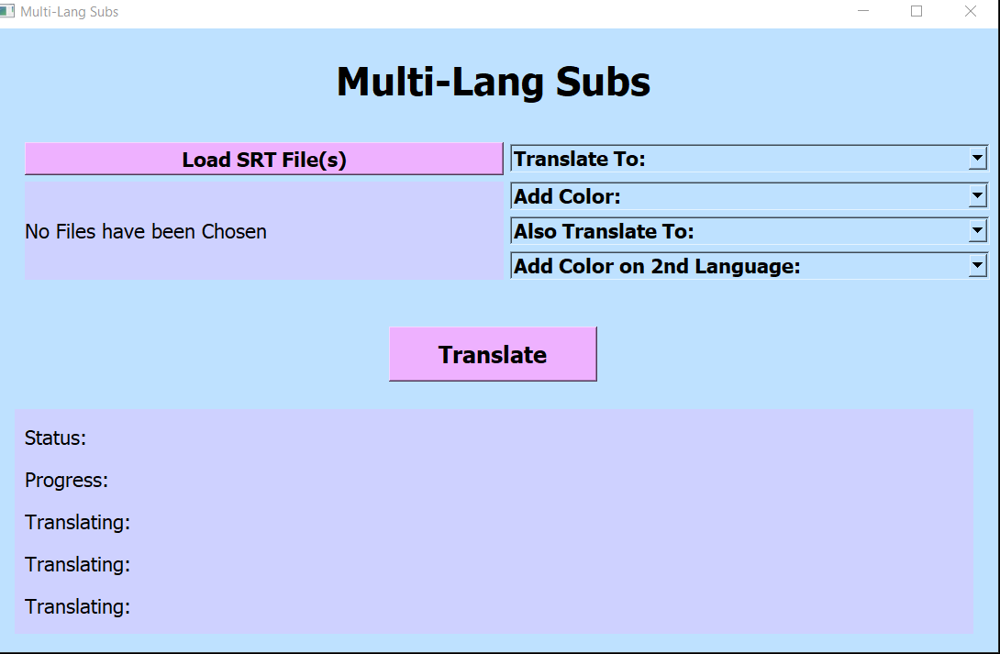

# Multi-Lang Subs 

An Application that Returns a subtitle file (.srt) in two languages.



## Purpose

This app is mostly useful for **practicing a new language**.

An English speaking series:


Can appear like that:


Or even like that:


## Run

You just clone the repo:
```bash
git clone https://github.com/voulkon/double_language_subtitles.git
cd double_language_subtitles
```

And then you can either: 
- run it as an executable:
```bash
sub_translate_app\sub_translate_app.exe
```

- or run it with python:
```bash
python sub_translate_app.py
```


If you choose to run it with python, you have complete freedom to tailor-make it either on its front or its back end.

In fact, in the app_params.py you can find parameters that easily change the application's look and feel, like its:
- colors (there are ready palettes in color_palettes.py but you can use your own) 
- window size, 
- fonts, 
- title, 
- labels, etc. 

## Credits

All translations are conducted using Google Translation via the UlionTse's [translators](https://github.com/UlionTse/translators) module (credits to both <3 ).